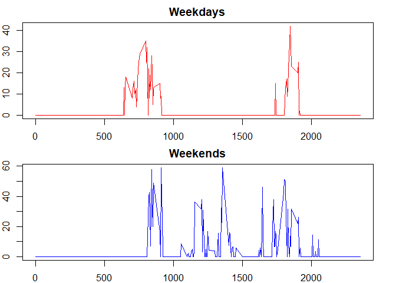

# Reproducible Research: Peer Assessment 1

## Loading and preprocessing the data
        

```r
if(!file.exists("activity.csv")) unzip("activity.zip")
data <- read.csv("activity.csv", header=TRUE, sep = ",", na.strings = "NA")
print(head(data))
```

```
##   steps       date interval
## 1    NA 2012-10-01        0
## 2    NA 2012-10-01        5
## 3    NA 2012-10-01       10
## 4    NA 2012-10-01       15
## 5    NA 2012-10-01       20
## 6    NA 2012-10-01       25
```


## What is mean total number of steps taken per day?

```r
steps_pday <- aggregate(steps ~ date, data, sum)
```
#### Make a histogram of the total number of steps taken each day

```r
library(ggplot2)
ggplot(steps_pday, aes(x=steps)) + geom_histogram(binwidth = 1000, color="black", fill="red") 
```

<!-- -->

#### Calculate and report the mean and median of the total number of steps taken per day
The mean value

```r
mean(steps_pday$steps)
```

```
## [1] 10766.19
```

The median value

```r
median(steps_pday$steps)
```

```
## [1] 10765
```

 

## What is the average daily activity pattern?

#### Make a time series plot (i.e. type = "l") of the 5-minute interval (x-axis) and the average number of steps taken, averaged across all days (y-axis)

```r
daily_pattern <- aggregate(steps ~ interval, data, median)
plot(daily_pattern, type="l", col="red")
```

<!-- -->

#### Which 5-minute interval, on average across all the days in the dataset, contains the maximum number of steps?


```r
daily_pattern[daily_pattern$steps==max(daily_pattern$steps),]
```

```
##     interval steps
## 106      845    60
```


## Imputing missing values

Note that there are a number of days/intervals where there are missing values (coded as NA). The presence of missing days may introduce bias into some calculations or summaries of the data.
 
#### Calculate and report the total number of missing values in the dataset (i.e. the total number of rows with NAs)


```r
table(is.na(data))
```

```
## 
## FALSE  TRUE 
## 50400  2304
```
There are 2304 missing values in the dataset

#### Devise a strategy for filling in all of the missing values in the dataset. 
I take the mean for that 5-minute interval


```r
data_aux <- merge(data, daily_pattern, by="interval", all.x = T)
```


#### Create a new dataset that is equal to the original dataset but with the missing data filled in.


```r
data2 <- data
data2[is.na(data2$steps), "steps"] <- data_aux[is.na(data_aux$steps.x), "steps.y"]
table(is.na(data2))
```

```
## 
## FALSE 
## 52704
```


Now there is no missing values in the new dataset


#### Make a histogram of the total number of steps taken each day and Calculate and report the mean and median total number of steps taken per day. Do these values differ from the estimates from the first part of the assignment? What is the impact of imputing missing data on the estimates of the total daily number of steps?


Calculating the data


```r
steps_pday2 <- aggregate(steps ~ date, data2, sum)
```

The impact of imputing missing data is shown in this plot:

```r
par(mfcol=c(1,2))
hist(steps_pday$steps, col = "red", main = "Histogram with NA", xlab = "Steps")
hist(steps_pday2$steps, col = "blue", main = "Histogram without NA", xlab = "Steps")
```

<!-- -->

The mean with NA:

```r
mean(steps_pday$steps)
```

```
## [1] 10766.19
```

The mean without NA:

```r
mean(steps_pday2$steps)
```

```
## [1] 9503.869
```

The median with NA:

```r
median(steps_pday$steps)
```

```
## [1] 10765
```

The median without NA:

```r
median(steps_pday2$steps)
```

```
## [1] 10395
```


## Are there differences in activity patterns between weekdays and weekends?

For this part the weekdays() function may be of some help here. Use the dataset with the filled-in missing values for this part.

#### Create a new factor variable in the dataset with two levels - "weekday" and "weekend" indicating whether a given date is a weekday or weekend day.


```r
data2$tday <- as.factor(ifelse(as.numeric(format(as.Date(data2[,2]),"%w")) %in% c(0,6), "weekend", "weekday"))
```

Note: I use numeric value of day instead of function weekday to avoid problems with my system's laguage (spanish)


#### Make a panel plot containing a time series plot (i.e. type = "l") of the 5-minute interval (x-axis) and the average number of steps taken, averaged across all weekday days or weekend days (y-axis). 
See the README file in the GitHub repository to see an example of what this plot should look like using simulated data.

Calculating the data: 

```r
data_weekends <- aggregate(steps ~ interval, data2[data2$tday=="weekend",], median)
data_weedays <- aggregate(steps ~ interval, data2[data2$tday=="weekday",], median)                        
```

Making the plot:


```r
par(mar = rep(2, 4))
par(mfcol=c(2,1))
plot(data_weedays, type="l", col="red", main="Weekdays")
plot(data_weekends, type="l", col="blue", main="Weekends")
```

<!-- -->
